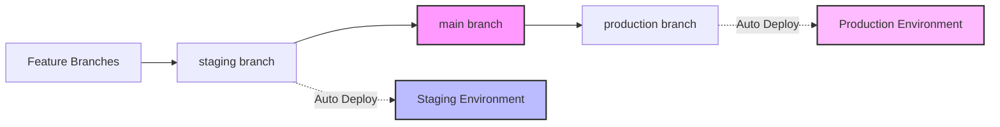

# Clear Match CI/CD Pipeline Documentation

## Overview

This document describes the CI/CD pipeline and deployment strategy for Clear Match, implementing a three-environment system with proper separation of concerns.

## Branch Strategy



### Branch Purposes

1. **Feature Branches** (`feature/*`, `fix/*`, issue numbers)
   - Where all development happens
   - Created from `staging` or `main`
   - Merged into `staging` via PR

2. **staging** (Protected)
   - Integration branch for testing
   - Auto-deploys to staging environment on push
   - Developers test features here before promoting to main

3. **main** (Protected - Golden Source)
   - Production-ready code only
   - NO automatic deployments
   - Source of truth for all releases
   - Tagged for version tracking

4. **production** (Protected)
   - Mirrors `main` branch content
   - Reset from `main` for deployments
   - Auto-deploys to production environment on push

## Environment Architecture

### Development (Local)
- **Database**: Points to Staging Supabase instance
- **Purpose**: Local development and testing
- **Access**: All developers

### Staging
- **URL**: `https://staging.clearmatch.app` (or similar)
- **Database**: Dedicated Staging Supabase instance
- **Purpose**: Integration testing, QA, stakeholder preview
- **Deployment**: Automatic on push to `staging` branch
- **Access**: Development team, QA, stakeholders

### Production
- **URL**: `https://clearmatch.app`
- **Database**: Dedicated Production Supabase instance
- **Purpose**: Live application for end users
- **Deployment**: Manual via production branch reset
- **Access**: End users

## Deployment Workflows

### 1. Feature Development Flow

```bash
# Start from staging
git checkout staging
git pull origin staging
git checkout -b feature/new-feature

# Make changes
git add .
git commit -m "feat: implement new feature"
git push origin feature/new-feature

# Create PR to staging
# After review and approval, merge to staging
# Staging automatically deploys
```

### 2. Promotion to Main (Golden Source)

```bash
# After QA approval in staging
# Create PR from staging to main
git checkout staging
git pull origin staging
gh pr create --base main --title "Release: v1.2.0" --body "Release notes..."

# After review and approval, merge to main
# NO deployment happens - main is just the golden source
```

### 3. Production Deployment

```bash
# When ready to deploy to production
git checkout main
git pull origin main
git tag -a v1.2.0 -m "Release version 1.2.0"
git push origin v1.2.0

# Reset production branch to main
git checkout production
git pull origin production
git reset --hard origin/main
git push --force-with-lease origin production

# Production automatically deploys
```

### 4. Hotfix Flow

```bash
# For critical production issues
git checkout production
git checkout -b hotfix/critical-fix

# Make fix
git add .
git commit -m "fix: resolve critical issue"
git push origin hotfix/critical-fix

# Create PR to production for immediate fix
# After merge, production auto-deploys

# Backport to main and staging
git checkout main
git cherry-pick <commit-hash>
git push origin main

git checkout staging
git cherry-pick <commit-hash>
git push origin staging
```

## CI/CD Pipeline Details

### GitHub Actions

#### Staging CI/CD (`staging-ci.yml`)
- **Triggers**: Push to `staging`, PRs to `staging`
- **Jobs**:
  1. Test Suite (lint, type check, unit tests)
  2. Build verification with staging environment
  3. Deployment notification (Vercel handles actual deployment)

#### Production Deployment (`production-deploy.yml`)
- **Triggers**: Push to `production`
- **Jobs**:
  1. Validate commit exists in `main` branch
  2. Production deployment notification
  3. Vercel handles actual deployment

#### Main Branch CI (`test.yml`)
- **Triggers**: Push to `main`, PRs to `main`
- **Jobs**:
  1. Full test suite
  2. Build verification
  3. Code coverage reporting

### Vercel Configuration

- **Production Branch**: `production` (not `main`)
- **Preview Deployments**: From `staging` branch
- **Environment Variables**: Separate for each environment
- **Deployment Protection**: Production requires manual promotion

### Supabase Architecture

- **Staging Database**: Separate project for staging/development
- **Production Database**: Isolated project with stricter access
- **Migrations**: Applied to staging first, then production
- **RLS Policies**: Identical across environments

## Security Considerations

1. **Branch Protection Rules**
   - `main`: Requires 2 reviewers, all checks passing
   - `staging`: Requires 1 reviewer, all checks passing
   - `production`: Requires 2 reviewers, restricted push access

2. **Environment Isolation**
   - Separate Supabase projects prevent data leakage
   - Environment-specific API keys and secrets
   - No shared resources between environments

3. **Deployment Authorization**
   - Only designated team members can push to `production`
   - All production deployments are audited
   - Rollback procedures documented

## Monitoring and Alerts

1. **Deployment Notifications**
   - Slack/Discord notifications for deployments
   - Success/failure status for each environment

2. **Error Tracking**
   - Sentry configured per environment
   - Different sampling rates for staging vs production

3. **Performance Monitoring**
   - Vercel Analytics for deployment metrics
   - Supabase dashboard for database performance

## Rollback Procedures

### Quick Rollback (Last Known Good)
```bash
git checkout production
git reset --hard <last-good-commit>
git push --force-with-lease origin production
```

### Version-based Rollback
```bash
git checkout production
git reset --hard v1.1.0  # Previous version tag
git push --force-with-lease origin production
```

## Best Practices

1. **Never push directly to protected branches**
2. **Always test in staging before promoting to main**
3. **Tag releases in main branch for easy rollback**
4. **Document breaking changes in PR descriptions**
5. **Keep production branch in sync with main**
6. **Run migrations in staging first**
7. **Monitor deployments until stable**

## Troubleshooting

### Common Issues

1. **Staging deployment failed**
   - Check GitHub Actions logs
   - Verify environment variables in Vercel
   - Ensure Supabase connection is valid

2. **Production doesn't match main**
   - Verify production was properly reset from main
   - Check for any direct commits to production

3. **Environment variables missing**
   - Check Vercel environment settings
   - Ensure variables are set for correct environment

## Emergency Procedures

### Production Down
1. Immediate rollback to last known good state
2. Investigate in staging environment
3. Deploy fix through hotfix flow if critical

### Data Corruption
1. Stop all deployments
2. Backup current state
3. Restore from Supabase backups if needed
4. Apply fixes through normal flow

## Version History

- **v1.0.0** - Initial CI/CD pipeline setup
- **v1.1.0** - Added staging environment
- **v1.2.0** - Implemented three-environment system (current)